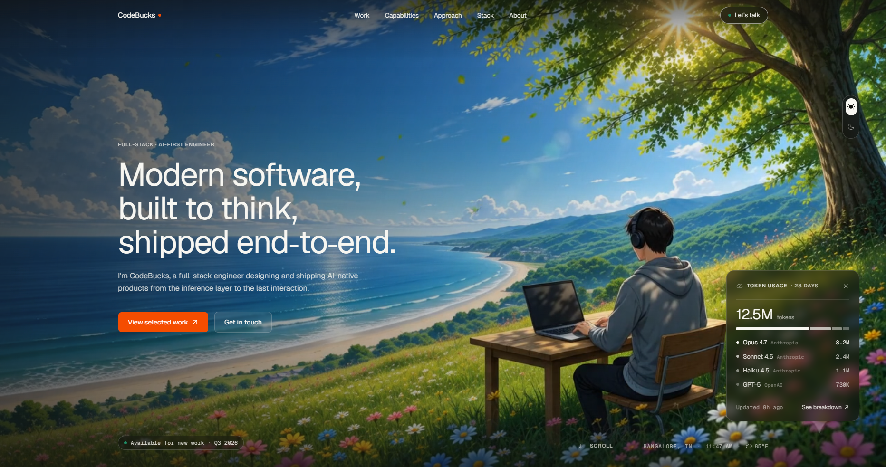
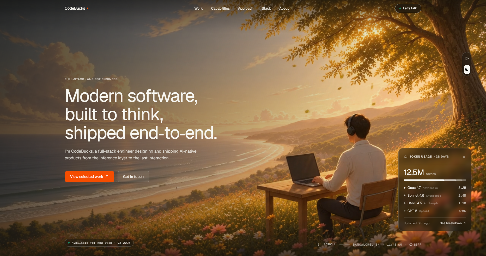
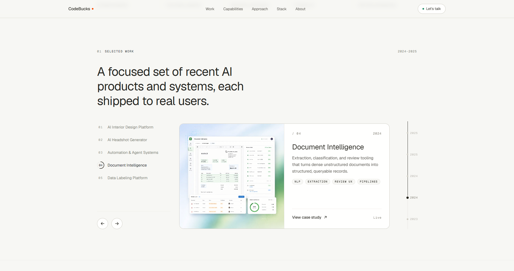
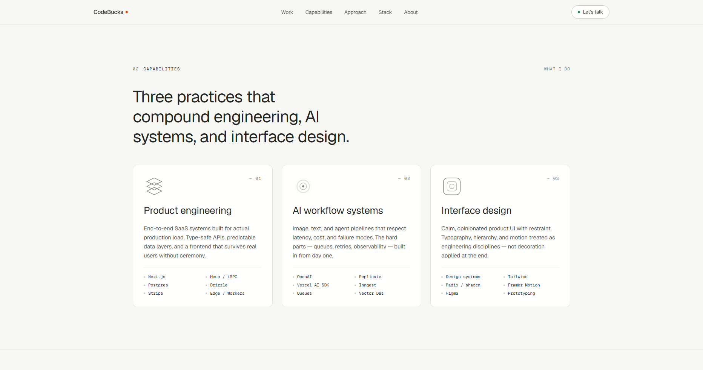
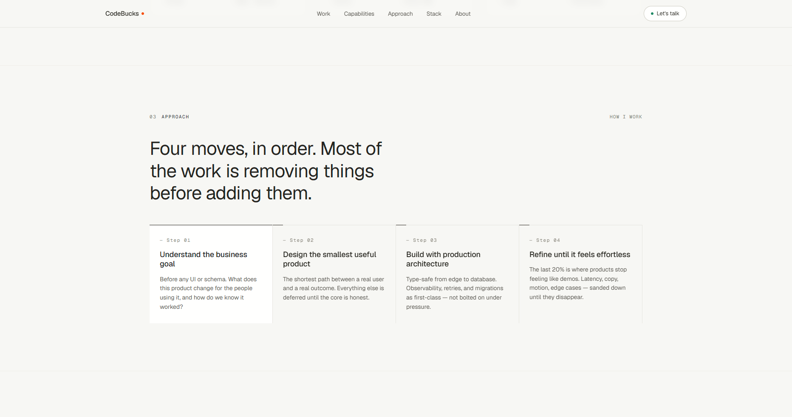
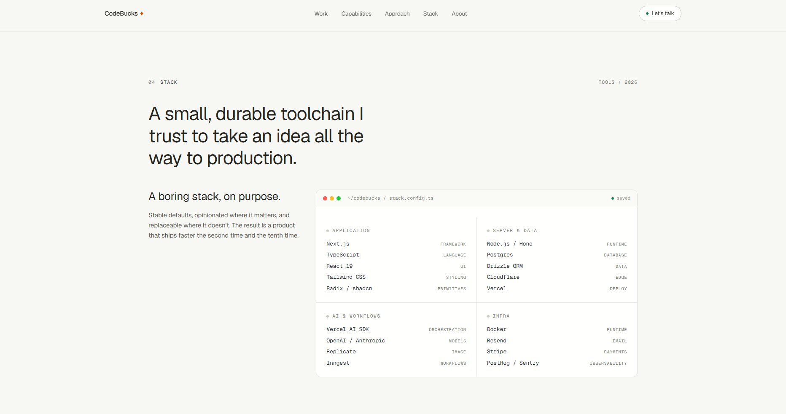
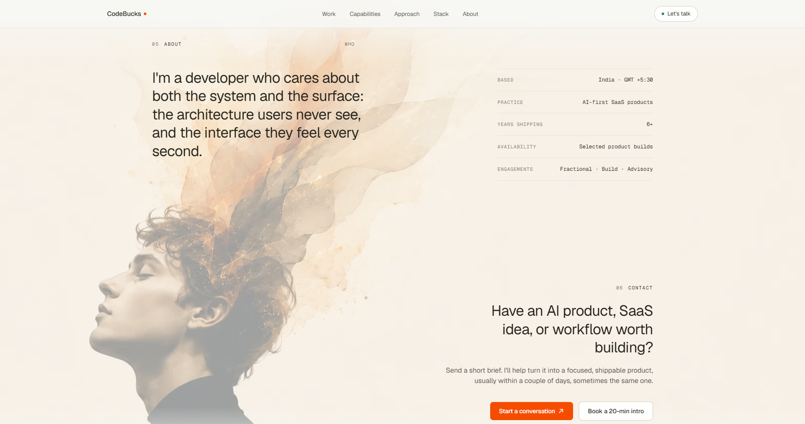
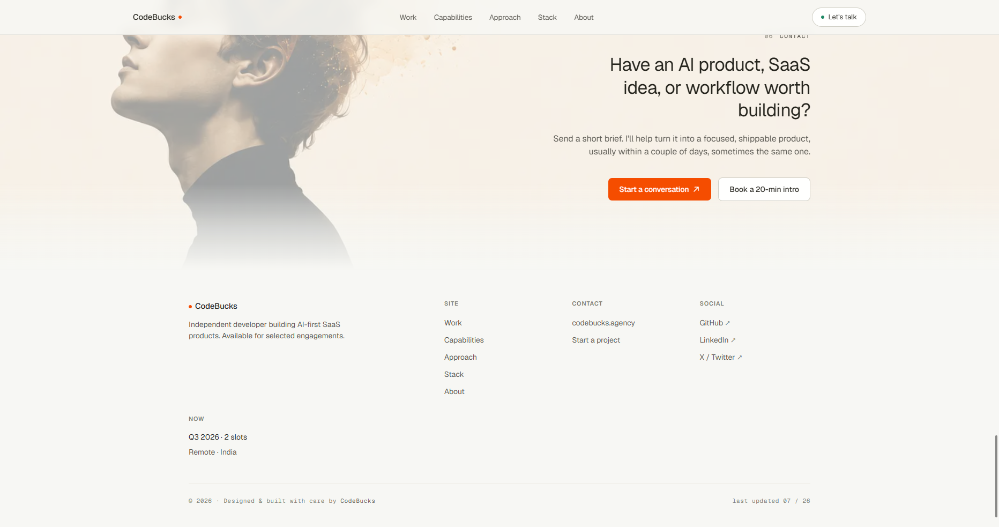

# Next.js 16 Modern Developer Portfolio - Tutorial Starter Files

**The official starter files for the CodeBucks tutorial: build a modern, editorial developer portfolio website with Next.js 16, Tailwind CSS v4, and Framer Motion animations.**

These are the **assets + content** you'll use to follow along with the video — so you can build the whole thing without pausing to copy-paste text or hunt for images. Clone it, open the tutorial, and code alongside.


---

## 📺 Watch the full tutorial 👇

> ▶️ *Click the following link to watch on YouTube.*
👉🏻 **[Build a Modern Developer Portfolio with Next.js 16, Tailwind v4 & Motion →](https://youtu.be/1qJEZVr6eXE)**

## ⚡ Want to skip ahead?

Get the **complete, production-ready final source code** - every component, the day/night switch, the widgets, and all the Motion polish, assembled and ready to run.

**[⚡ Get instant access to the final code →](https://store.dodopayments.com/codebucks)**

> The final repo lands in your GitHub account via private invitation, so you can clone, customize, and deploy immediately.

---



## 🎯 What you'll build

A production-quality **Next.js 16 portfolio website** with a warm, editorial "magazine" design system and choreographed motion:

- 🌗 **Interactive day/night hero switch** - swap a day background video for a night one with smooth choreography (the signature feature).
- 📍 **Live visitor location + real-time weather widget** - server geolocation with **zero API keys**.
- 📊 **Animated AI token-usage widget** - a stat card that comes alive.
- 🎨 **Editorial design system** - cream canvas, hairline borders (no drop shadows), light display type, one orange accent.
- 🖼️ **Selected Work** animated project carousel.
- 🧩 **Capabilities** section with hand-crafted animated icons.
- 🪜 **Approach**, faux code-editor **Stack**, **About** + **Contact** sections.
- 🧭 Scroll-aware **header** with mobile menu, plus a matching footer.
- 🎬 **Framer Motion animations** - scroll reveals via a reusable component, with full `prefers-reduced-motion` support.
- 📱 Fully **responsive** and content-centralized.

Built with **Next.js 16 (App Router + Turbopack)**, **React 19**, **TypeScript**, **Tailwind CSS v4**, **shadcn/ui**, **Motion (Framer Motion)**, **@phosphor-icons/react**, and **next-themes**.

---

## 📦 What's inside this starter (vs. what you'll build)

This repo is intentionally small - it holds the **content and media** so you can focus on building the actual site in the video.

| ✅ Included in the starter | 🛠️ You build in the tutorial |
|---|---|
| A pre-configured **Next.js 16 scaffold** - clone, `bun install`, `bun dev` and you're running | Every component and section |
| `public/assets/` - all images, hero **day + night videos**, and posters | The design system in `app/globals.css` |
| `lib/content.ts` - all site copy pre-written (nav, projects, capabilities, stack, footer) | The day/night switch, widgets, and Motion animations |

> 💡 Pre-written content means **no pausing to copy text**. Pull it from `lib/content.ts` exactly when the video does.

---

## 🚀 How to use these starter files

Clone this repo **alongside the tutorial** and code as you watch. pnpm is the supported package manager for this project.

```bash
# 1. Clone the starter files
git clone https://github.com/codebucks27/nextjs-portfolio-starter-template.git
cd nextjs-portfolio-starter-template

# 2. Install dependencies
pnpm install

# 3. Start the dev server
pnpm dev

# 4. Open http://localhost:3000 and start building along with the video 🎬
```

> ℹ️ **Requirements:** Node.js 20.9+ and pnpm. No API keys or `.env` file are needed—the weather and location features use free, keyless services.


## ⭐ Found this useful?

**Please star this repo** - it helps other developers find the tutorial and keeps free content like this coming. It takes two seconds and genuinely makes a difference. 🙏

---

## 📸 Screenshots

### 🌙 Hero — Night mode


### 🗂️ Selected Work


### 🧩 Capabilities


### 🪜 Approach


### 💻 Stack


### ✉️ Contact


### 🔻 Footer


---

## 💬 Connect with CodeBucks

- 📺 YouTube — [youtube.com/codebucks](https://www.youtube.com/codebucks)
- 🐦 X / Twitter — [@code_bucks](https://twitter.com/code_bucks)
- 🌐 Website — [devdreaming.com](https://devdreaming.com)
- ✉️ Email — [codebucks27@gmail.com](mailto:codebucks27@gmail.com)
- 🧩 **Need a custom website built?** [Start a project →](https://codebucks.agency)

---

<p align="center"><em>Happy building and don't forget to ⭐ the repo!</em></p>
